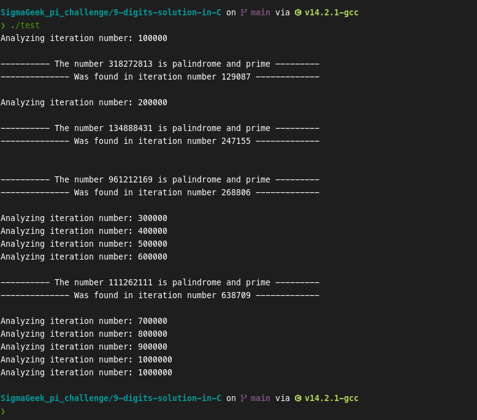

# Sigma Geek pi challenge

This repository contains the solution to a challenge from Sigma Geek.

## About the challenge

- Step 1: Find the first occurrence of a 9-digit palindromic prime number in the decimal expansion of π.
- Step 2: Find the first occurrence of a 21-digit palindromic prime number in the decimal expansion of π.
- Step 3: Find the largest palindromic prime contained in the decimal expansion of π, considering the first 100T digits.

## Screenshots

